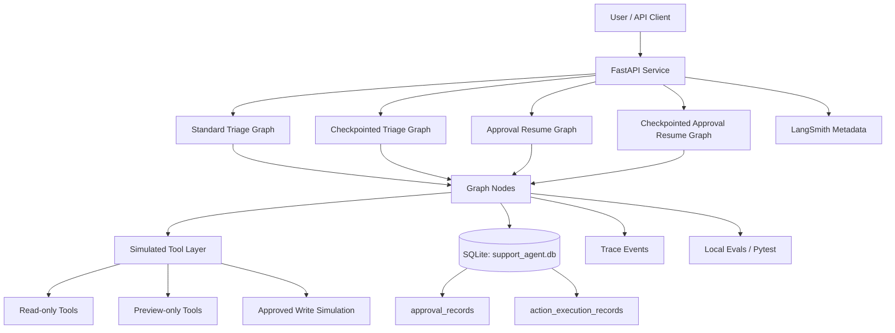
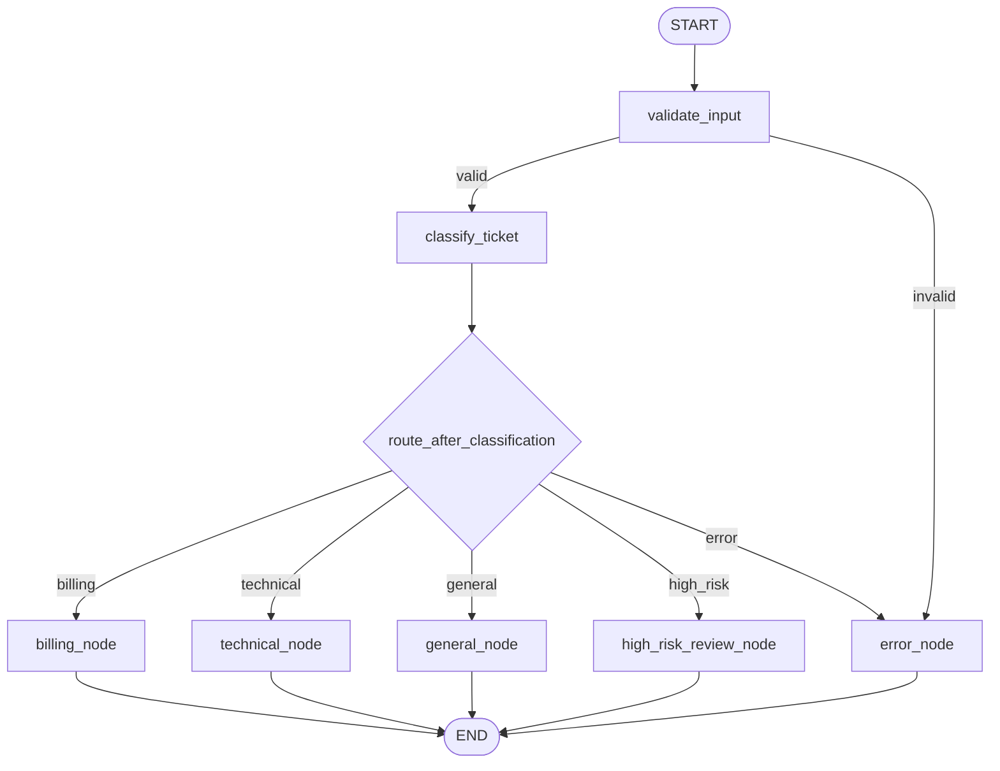
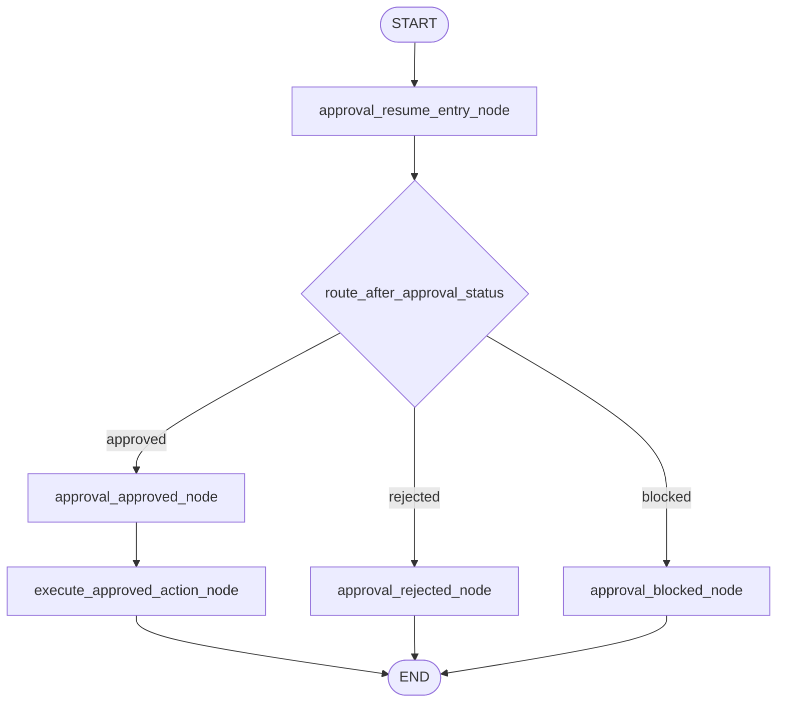
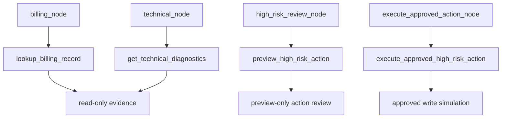
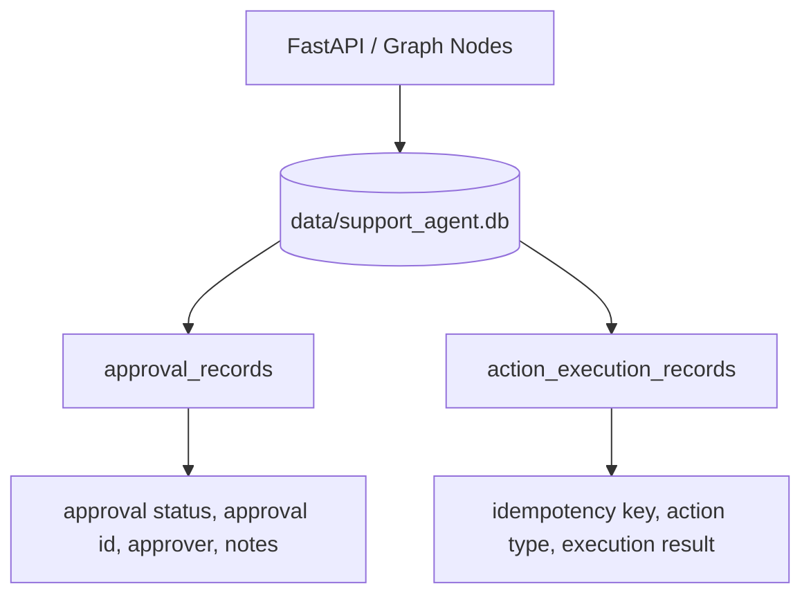
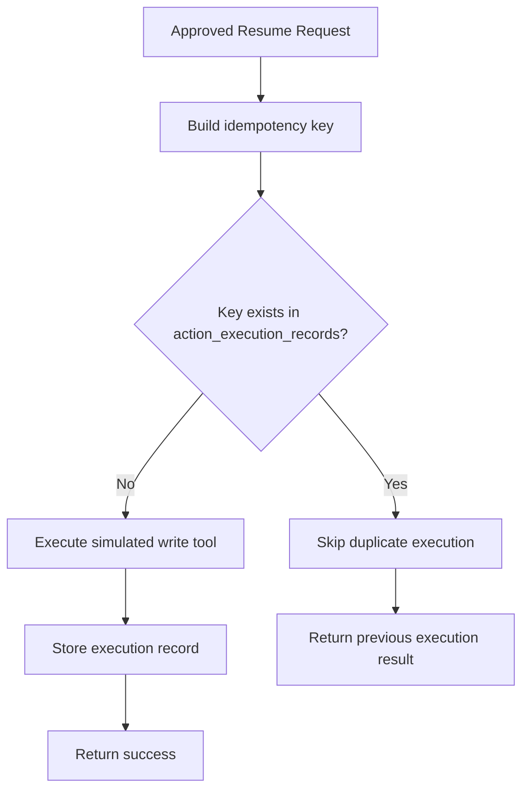

# Support Ticket Triage Agent v2 — Architecture

This document summarizes the current architecture of `support_ticket_triage_agent_v2` after completion of the core engineering milestones.

The project demonstrates a production-style agent workflow with:

- graph-based orchestration
- typed state
- deterministic routing
- safe tool boundaries
- human-in-the-loop approval
- idempotency-protected approved write simulation
- SQLite-backed persistence
- checkpointed graph execution
- true interrupt-style pause/resume experiment
- FastAPI service endpoints
- local evals and pytest coverage

---

## High-Level System Architecture



---

## Main Runtime Components

| Component | Purpose |
|---|---|
| `app/api.py` | FastAPI endpoints for standard and checkpointed flows |
| `app/graph.py` | LangGraph graph definitions |
| `app/nodes.py` | Graph node implementations |
| `app/state.py` | Typed graph state |
| `app/schemas.py` | API request/response schemas |
| `app/tools.py` | Read-only and preview-only simulated tools |
| `app/write_tools.py` | Approved simulated write tool with idempotency |
| `app/db.py` | SQLite database initialization |
| `app/sqlite_approval_store.py` | Active approval persistence layer |
| `app/sqlite_action_store.py` | Active action execution persistence layer |
| `app/checkpointing.py` | Checkpointer and thread ID helpers |

---

## Graph Variants

The project currently contains multiple graph variants so each HITL maturity level can be demonstrated without destabilizing the earlier paths.

| Graph | Purpose |
|---|---|
| `ticket_graph` | Standard triage graph |
| `approval_resume_graph` | Standard approval resume graph |
| `checkpointed_ticket_graph` | Checkpoint-enabled triage graph |
| `checkpointed_approval_resume_graph` | Checkpoint-enabled approval resume graph |
| `interruptible_ticket_graph` | True interrupt-style HITL graph experiment |

---

## Standard Triage Graph



### Key design idea

```text
LLM/classifier creates structured classification.
Deterministic Python routing decides workflow path.
```

This keeps control flow out of the model's free-form generation.

---

## Approval Resume Graph



### Approved path

```text
approval_resume_entry_node
→ approval_approved_node
→ execute_approved_action_node
→ END
```

### Rejected path

```text
approval_resume_entry_node
→ approval_rejected_node
→ END
```

---

## Interruptible HITL Graph

The interruptible graph demonstrates true LangGraph pause/resume behavior.

```mermaid
flowchart TD
    Start([START]) --> Validate[validate_input]
    Validate --> Classify[classify_ticket]
    Classify --> Route{route_after_classification}

    Route -->|billing| Billing[billing_node]
    Route -->|technical| Technical[technical_node]
    Route -->|general| General[general_node]
    Route -->|high_risk| HighRisk[high_risk_review_node]

    HighRisk --> Interrupt[human_approval_interrupt_node]
    Interrupt --> Pause[[interrupt(...) pause]]
    Pause --> Resume[[Command resume payload]]
    Resume --> Decision{route_after_approval_status}

    Decision -->|approved| Approved[approval_approved_node]
    Approved --> Execute[execute_approved_action_node]
    Execute --> End([END])

    Decision -->|rejected| Rejected[approval_rejected_node]
    Rejected --> End

    Decision -->|blocked| Blocked[approval_blocked_node]
    Blocked --> End

    Billing --> End
    Technical --> End
    General --> End
```

### Interrupt flow

```text
interruptible_ticket_graph.invoke(initial_state, config={"configurable": {"thread_id": ...}})
→ high-risk request reaches human_approval_interrupt_node
→ graph pauses with interrupt(...)
```

### Resume flow

```text
interruptible_ticket_graph.invoke(Command(resume={...}), config=same_config)
→ same graph thread resumes
→ approved path executes simulated write tool
→ rejected path blocks safely
```

---

## Tool Layer



| Tool | Type | Node | Side effect |
|---|---|---|---|
| `lookup_billing_record` | read-only | `billing_node` | none |
| `get_technical_diagnostics` | read-only | `technical_node` | none |
| `preview_high_risk_action` | preview-only | `high_risk_review_node` | none |
| `execute_approved_high_risk_action` | approved write simulation | `execute_approved_action_node` | simulated only |

Tool results are captured in graph state:

```text
tool_results
```

---

## Persistence Architecture

Active runtime persistence is SQLite-backed.



SQLite tables:

| Table | Purpose |
|---|---|
| `approval_records` | Stores latest approval/rejection decision per ticket |
| `action_execution_records` | Stores idempotency-protected approved action execution records |

The SQLite database file is generated locally and ignored by Git:

```text
data/support_agent.db
```

Legacy JSON stores are retained as simple reference implementations:

```text
app/approval_store.py
app/action_store.py
data/approvals.json
data/action_executions.json
```

---

## Idempotency Architecture

Approved write simulations use an idempotency key:

```text
<ticket_id>:<approval_id>:<action_type>
```

Example:

```text
HITL-001:approval_123:simulated_high_risk_action
```



This prevents duplicate simulated side effects during repeated resume calls.

---

## API Surface

| Endpoint | Purpose |
|---|---|
| `GET /health` | Health check |
| `POST /tickets/triage` | Standard triage |
| `POST /tickets/triage/checkpointed` | Checkpointed triage with `thread_id` |
| `POST /tickets/{ticket_id}/approval` | Record approval/rejection |
| `GET /tickets/{ticket_id}/approval` | Retrieve approval decision |
| `POST /tickets/{ticket_id}/resume` | Standard approval resume |
| `POST /tickets/{ticket_id}/resume/checkpointed` | Checkpointed approval resume with `thread_id` |

---

## Observability and Evaluation

The project records:

- workflow path
- trace events
- tool results
- approval status
- idempotency behavior
- final response

Local verification:

```text
pytest: 70/70 passed
python -m evals.run_eval: 5/5 passed
```

CI runs the same verification in cost-safe mock mode.

---

## Current Limitations

This is a production-style local portfolio project, not a deployed production service.

Current limitations:

- tools are deterministic simulations
- approved write action is simulated only
- SQLite is local, not Postgres/MySQL
- `MemorySaver` checkpointing is local/in-memory
- interruptible graph is tested at graph level, not exposed as a public API endpoint
- no production authentication or authorization yet
- no real approver identity verification yet
- no approval expiration policy yet
- no distributed locking or multi-worker coordination yet

---

## Future Production Direction

A production-grade version would add:

- durable checkpoint store beyond `MemorySaver`
- Postgres-backed persistence
- database migrations
- role-based approval authorization
- approval expiration timestamps
- durable audit logs
- real external tool integrations
- API authentication
- LangSmith dataset-based evals
- deployment configuration